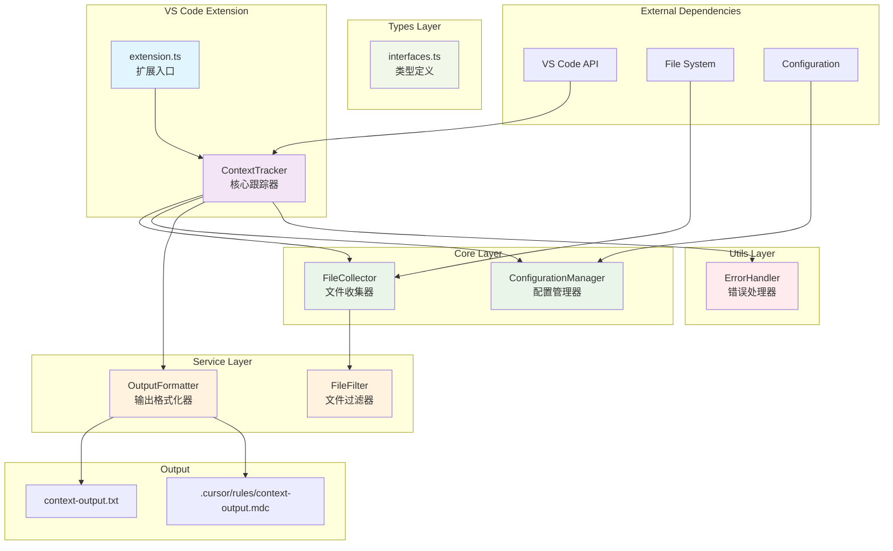
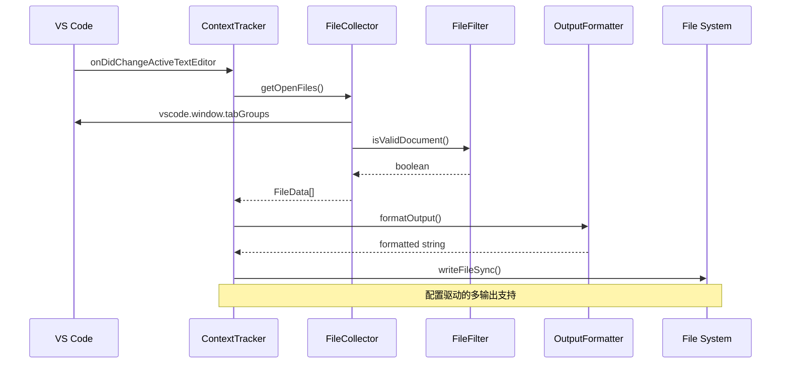
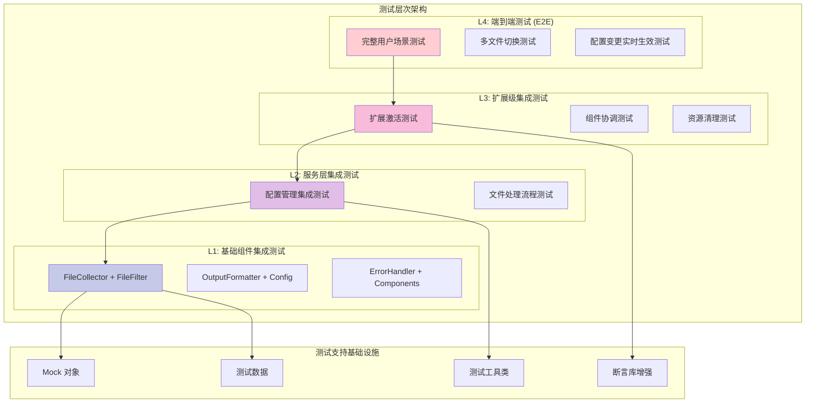
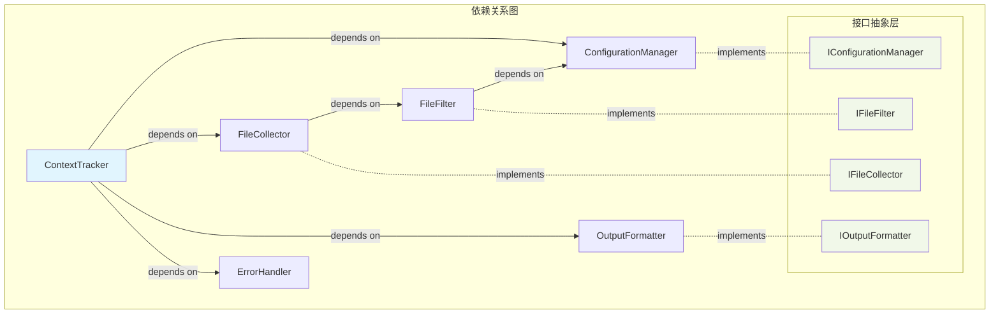
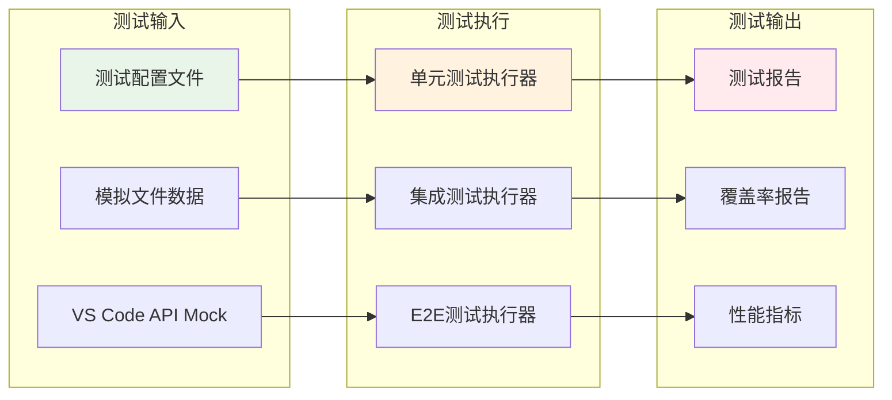
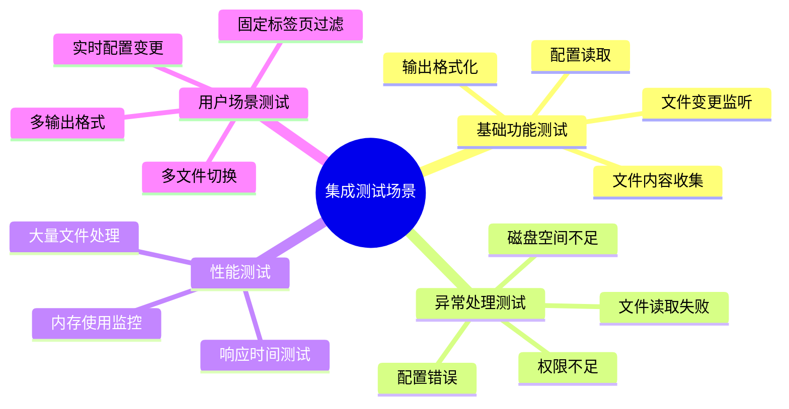
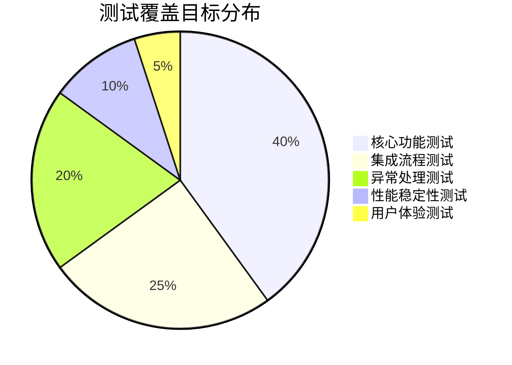

# Auto Copilot Context - 架构图与测试策略

## 当前项目架构



## 数据流架构



## 测试架构设计



## 测试策略矩阵

```mermaid
graph LR
    subgraph "测试类型"
        A[单元测试<br/>Unit Tests]
        B[集成测试<br/>Integration Tests]
        C[端到端测试<br/>E2E Tests]
    end
    
    subgraph "测试目标"
        D[功能正确性<br/>Functionality]
        E[组件交互<br/>Integration]
        F[用户体验<br/>User Experience]
    end
    
    subgraph "测试工具"
        G[Mocha + Chai<br/>测试框架]
        H[Sinon<br/>模拟对象]
        I[@vscode/test-electron<br/>VS Code 环境]
    end
    
    A --> D
    B --> E
    C --> F
    
    D --> G
    E --> H
    F --> I
    
    style A fill:#e8f5e8
    style B fill:#fff3e0
    style C fill:#ffebee
```

## 组件依赖关系



## 测试数据流



## 关键测试场景



## 测试覆盖范围



---

**架构说明：**

1. **分层架构**: 清晰的职责分离，便于测试和维护
2. **接口抽象**: 支持依赖注入，便于模拟测试
3. **测试分级**: 从单元到端到端的完整测试体系
4. **数据驱动**: 配置化的输出格式和过滤规则

**测试策略重点：**

1. **渐进式测试**: 从简单到复杂，逐步构建测试体系
2. **真实环境**: 利用 VS Code 测试框架确保环境一致性
3. **全面覆盖**: 功能、集成、异常、性能多维度测试
4. **持续集成**: 自动化测试执行和质量监控