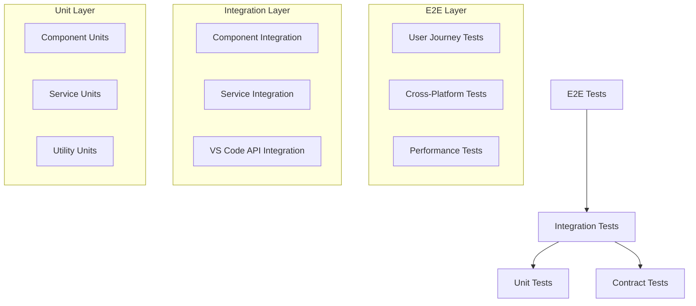

# Auto Copilot Context - 集成测试实现计划

## 项目分析

### 当前架构概览
- **项目类型**: VS Code 扩展，用于自动收集和输出当前打开文件的上下文信息
- **核心功能**: 监听文件变化 → 收集文件信息 → 过滤处理 → 格式化输出
- **技术架构**: 分层架构，使用接口抽象，依赖注入模式

### 现有代码结构
```
src/
├── core/
│   ├── ContextTracker.ts      # 核心跟踪器，协调各组件
│   └── FileCollector.ts       # 文件收集器
├── services/
│   ├── ConfigurationManager.ts # 配置管理
│   ├── FileFilter.ts          # 文件过滤
│   └── OutputFormatter.ts     # 输出格式化
├── utils/
│   └── ErrorHandler.ts        # 错误处理
├── types/
│   └── interfaces.ts          # 类型定义
└── test/
    ├── runTest.ts             # 测试运行器
    └── suite/
        └── extension.test.ts  # 基础测试（待完善）
```

## 测试框架分析与对比

### 当前测试栈
- **Mocha**: 测试运行器，已集成
- **@vscode/test-electron**: VS Code 扩展测试框架
- **Node.js Assert**: 基础断言库

### 测试框架对比分析

| 框架组合 | 优势 | 劣势 | 适用场景 |
|---------|------|------|----------|
| **Mocha + @vscode/test-electron** (当前) | • VS Code 官方支持<br>• 已集成在项目中<br>• 支持真实 VS Code 环境 | • 启动较慢<br>• 配置复杂<br>• 调试困难 | VS Code 扩展集成测试 |
| **Jest + @vscode/test-electron** | • 丰富的匹配器<br>• 快照测试<br>• 并行执行 | • 配置复杂<br>• 与 VS Code 测试集成需要额外配置 | 单元测试 + 集成测试 |
| **Vitest + @vscode/test-electron** | • 快速启动<br>• 现代化 API<br>• 热重载 | • 新框架，生态不如 Jest<br>• VS Code 集成需要额外配置 | 现代化测试需求 |

### 推荐方案
**保持 Mocha + @vscode/test-electron**，增强断言库：
- 添加 `chai` 和 `sinon` 提供更丰富的断言和模拟功能
- 利用现有配置，最小化迁移成本
- 专注于 VS Code 扩展的特定测试需求

## 集成测试实现计划

### 阶段一：测试基础设施完善
1. **增强测试工具**
   - 添加 chai 断言库
   - 添加 sinon 模拟库
   - 创建测试工具类

2. **测试环境配置**
   - 配置测试数据目录
   - 创建测试文件模板
   - 设置测试清理机制

### 阶段二：单元测试（为集成测试打基础）
1. **核心组件单元测试**
   - FileCollector 单元测试
   - FileFilter 单元测试
   - OutputFormatter 单元测试
   - ConfigurationManager 单元测试

2. **工具类测试**
   - ErrorHandler 测试
   - 接口定义验证

### 阶段三：集成测试实现（由浅到深）

#### Level 1: 基础组件集成测试
**目标**: 测试相邻组件间的交互
- FileFilter + FileCollector 集成
- OutputFormatter + 配置管理集成
- 错误处理 + 各组件集成

#### Level 2: 服务层集成测试
**目标**: 测试服务层的完整工作流
- 配置变更 → 组件重新初始化
- 文件收集 → 过滤 → 格式化 → 输出
- 错误场景处理

#### Level 3: 扩展级集成测试
**目标**: 测试完整的 VS Code 扩展功能
- 扩展激活 → 组件初始化
- 文件切换 → 上下文更新 → 文件输出
- 配置变更 → 实时生效
- 扩展卸载 → 资源清理

#### Level 4: 端到端集成测试
**目标**: 测试真实用户场景
- 多文件切换场景
- 配置项组合测试
- 固定标签页过滤测试
- 多输出格式同时输出测试
- 长时间运行稳定性测试

### 阶段四：测试优化与维护
1. **性能测试**
   - 大量文件处理性能测试
   - 内存泄漏检测
   - 并发处理测试

2. **可靠性测试**
   - 异常恢复测试
   - 边界条件测试
   - 配置错误处理测试

## 测试数据设计

### 测试文件结构
```
src/test/
├── fixtures/                 # 测试数据
│   ├── sample-files/         # 示例文件
│   ├── config-templates/     # 配置模板
│   └── expected-outputs/     # 期望输出
├── helpers/                  # 测试辅助工具
│   ├── TestHelper.ts        # 测试工具类
│   ├── MockVSCode.ts        # VS Code API 模拟
│   └── FileSystemHelper.ts  # 文件系统操作
├── unit/                     # 单元测试
│   ├── core/
│   ├── services/
│   └── utils/
└── integration/              # 集成测试
    ├── basic/               # 基础集成测试
    ├── service-level/       # 服务层集成测试
    ├── extension-level/     # 扩展级集成测试
    └── e2e/                 # 端到端测试
```

### 测试场景设计
1. **文件类型覆盖**: TypeScript, JavaScript, JSON, Markdown, 二进制文件
2. **配置场景**: 单输出、多输出、自定义格式、固定标签页过滤
3. **边界条件**: 空文件、大文件、特殊字符、中文文件名
4. **错误场景**: 权限错误、磁盘空间不足、配置错误

## 实现优先级

### 高优先级（Must Have）
1. ✅ 测试基础设施完善
2. ✅ 核心组件单元测试
3. ✅ 基础集成测试（Level 1-2）

### 中优先级（Should Have）
1. ✅ 扩展级集成测试（Level 3）
2. ✅ 主要用户场景的端到端测试

### 低优先级（Could Have）
1. ⭕ 完整的端到端测试覆盖
2. ⭕ 性能和可靠性测试
3. ⭕ 自动化测试报告

## 成功指标

### 测试覆盖率目标
- 单元测试覆盖率 ≥ 80%
- 集成测试覆盖核心流程 100%
- 关键路径端到端测试覆盖率 ≥ 90%

### 质量指标
- 所有测试用例执行时间 < 30秒
- 测试稳定性 ≥ 95%（避免 flaky tests）
- 错误场景覆盖率 ≥ 70%

## 风险与缓解策略

### 主要风险
1. **VS Code API 模拟复杂度**: VS Code 环境依赖较多
2. **异步操作测试**: 文件监听和异步处理的测试
3. **文件系统操作**: 跨平台文件操作的一致性

### 缓解策略
1. **使用官方测试框架**: 充分利用 @vscode/test-electron
2. **分层测试策略**: 单元测试 + 集成测试 + 端到端测试
3. **测试工具类**: 创建专用的测试辅助工具
4. **CI/CD 集成**: 自动化测试执行和报告

## 时间估算

| 阶段 | 预估时间 | 主要任务 |
|------|----------|----------|
| 阶段一 | 1-2天 | 測試基础设施完善 |
| 阶段二 | 2-3天 | 单元测试实现 |
| 阶段三 | 3-5天 | 集成测试实现（Level 1-4） |
| 阶段四 | 2-3天 | 测试优化与维护 |
| **总计** | **8-13天** | **完整测试体系** |

---

*此计划将确保 Auto Copilot Context 扩展具备完整、可靠的测试体系，为后续功能开发和维护提供坚实基础。*

## 深层次集成测试技术选型

### 技术选型决策矩阵

#### 1. 测试框架选择
| 特性 | Mocha + Chai + Sinon | Jest + VS Code | Vitest + Testing Library |
|------|---------------------|----------------|------------------------|
| **VS Code 集成** | ✅ 官方支持 | ⚠️ 需要配置 | ❌ 复杂配置 |
| **断言丰富性** | ✅ Chai 强大 | ✅ Jest 内置 | ✅ Vitest 现代 |
| **模拟能力** | ✅ Sinon 专业 | ✅ Jest Mock | ✅ Vi Mock |
| **性能** | ⚠️ 中等 | ✅ 快速 | ✅ 最快 |
| **学习曲线** | ⚠️ 中等 | ✅ 简单 | ✅ 简单 |
| **生态成熟度** | ✅ 最成熟 | ✅ 成熟 | ⚠️ 较新 |

**选择：Mocha + Chai + Sinon**
- 理由：最佳的 VS Code 扩展兼容性，丰富的断言和模拟能力

#### 2. 测试分层策略



#### 3. 测试数据管理策略

```typescript
// 测试数据分层
interface TestDataLayer {
  fixtures: {
    files: TestFile[];
    configurations: TestConfig[];
    expectedOutputs: ExpectedOutput[];
  };
  builders: {
    fileBuilder: FileBuilder;
    configBuilder: ConfigBuilder;
    contextBuilder: ContextBuilder;
  };
  scenarios: {
    happyPath: TestScenario[];
    errorCases: TestScenario[];
    edgeCases: TestScenario[];
  };
}
```

## 深层次 Demo 实现方案

### Demo 1: 核心组件集成测试
**目标**: 展示 FileCollector + FileFilter + OutputFormatter 的完整集成

### Demo 2: 服务层端到端测试
**目标**: 展示配置变更到输出文件的完整流程

### Demo 3: VS Code 扩展集成测试
**目标**: 展示真实 VS Code 环境下的完整用户场景

### Demo 4: 性能和并发测试
**目标**: 展示大量文件处理和并发场景的测试策略

## 测试实现优先级矩阵

| 测试类型 | 业务价值 | 技术复杂度 | 实现优先级 | 预估工作量 |
|----------|----------|------------|------------|------------|
| **单元测试** | 中 | 低 | 🔥 高 | 2-3天 |
| **基础集成测试** | 高 | 中 | 🔥 高 | 2-3天 |
| **VS Code 集成测试** | 高 | 高 | 🔥 高 | 3-4天 |
| **端到端测试** | 高 | 高 | 🟡 中 | 3-5天 |
| **性能测试** | 中 | 高 | 🟡 中 | 2-3天 |
| **跨平台测试** | 中 | 中 | 🔵 低 | 1-2天 |

## 测试质量保障策略

### 1. 测试可靠性保障
- **Flaky Test 检测**: 每个测试用例运行多次验证稳定性
- **隔离性保障**: 测试间完全隔离，避免状态污染
- **幂等性验证**: 测试可重复执行且结果一致

### 2. 测试覆盖率策略
```typescript
// 覆盖率目标设定
const CoverageTargets = {
  statements: 85,
  branches: 80,
  functions: 90,
  lines: 85,
  // 关键路径必须 100% 覆盖
  criticalPaths: 100
};
```

### 3. 测试性能优化
- **并行执行**: 独立测试用例并行运行
- **资源复用**: 测试环境和数据复用
- **增量测试**: 只运行变更相关的测试

### 4. 测试反馈循环
